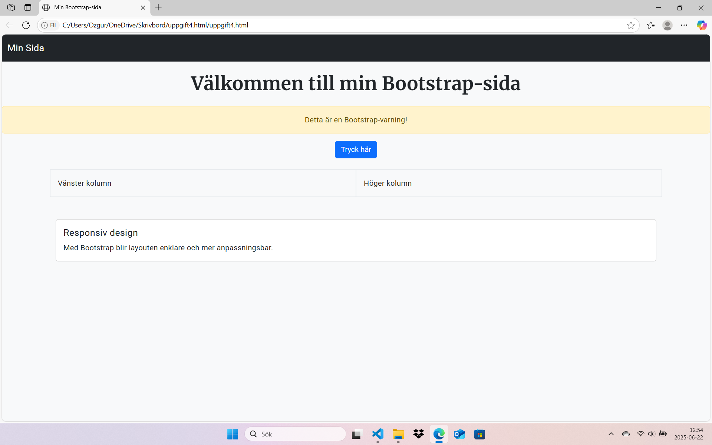

# Uppgift 4 – Bootstrap Grunder

Detta projekt är en del av Vecka 4 där vi lär oss grunderna i layout, typografi och ramverk som Bootstrap.

## ✅ Innehåll

- Rubrik centrerad
- Alertbox (varning)
- Knapp i mitten
- Två Bootstrap-kolumner (responsiv layout)
- Ett Bootstrap-kort (card)
- Google Fonts för rubrik och brödtext
- UI-principer: kontrast, spacing, centrering
- Responsiv design

## 🧪 Testat

- Fungerar i webbläsare
- Responsivt vid fönsterändring
- Validerad via W3C

## 🖼️ Skärmdump

## 👤 Av: Özgur (Tasman1984)
